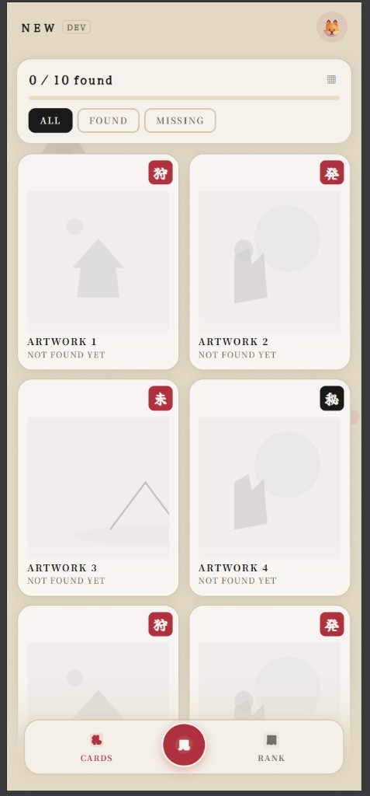
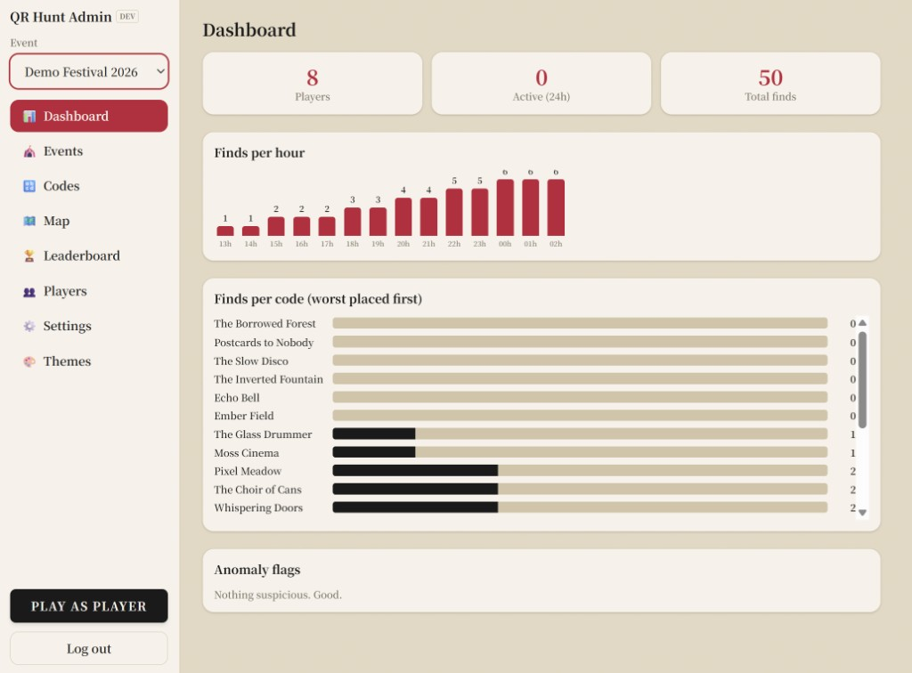

# QR Hunt

Offline-capable QR treasure hunt for festivals and events. Players scan hidden codes,
unlock collectible art cards, and compete on a server-backed leaderboard. Organizers run
everything from a built-in admin panel.

Built as an **Angular PWA** — that is what runs in production today (Cloudflare Pages + Supabase).
An **Android Capacitor** shell is in the repo for a future native APK (MLKit scanning), but it is
not built or released yet; players use the installed PWA in the browser.

<p align="center">
  
  &nbsp;&nbsp;
  
</p>

<sub>Real app screenshots from the dev deployment.</sub>

## What it does

**Players**

- Scan QR codes (camera or manual entry) to unlock themed art cards
- Browse a card grid and collection; works offline after the hunt pack is cached
- Climb the leaderboard; sync finds when back online
- Pick visual themes when the event allows it (EN / SK / CS)

**Organizers (admin)**

- Create events, generate codes in bulk, upload card art with crop
- Set one **live** hunt for all players; schedule code releases and hunt dates
- Map editor, leaderboard flags, player list, print sheet, theme settings
- Switch to **player view** to test the hunt as a competitor

## Quick start (local mock)

No Supabase needed — full demo on IndexedDB:

```bash
fnm use          # Node version from .node-version
npm install
npm start        # http://localhost:4200
```

On first launch:

- **Admin:** nickname `admin`, password `admin123` → `/admin`
- **Demo event** with 20 codes (5 time-gated) and a seeded leaderboard
- **Desktop scan:** Admin → Codes, show a QR on screen, scan with webcam — or enable manual entry in Settings and type a code on Profile

## Quick start (Supabase — like production)

1. Copy credentials into `src/environments/environment.local.ts` (gitignored) — see `supabase/README.md`
2. `npm run start:supabase` → `http://localhost:4200`
3. For phone testing over Wi‑Fi: `npm run start:supabase:lan` (camera still needs HTTPS; use Cloudflare preview for real device scans)

Daily backend work targets the **QRHant-Dev** project. Production uses **QRHant-Backend**.

## Deployed environments

| Branch | Hosting | Database | Typical use |
| --- | --- | --- | --- |
| `dev` | Cloudflare Pages preview | QRHant-Dev | Daily testing, designers |
| `main` | Cloudflare Pages production | QRHant-Backend | Live events |

Preview and production builds use `npm run build:pages` with `SUPABASE_*` env vars in Cloudflare (never committed). See [Cloudflare Pages](#cloudflare-pages) below.

## Architecture

All UI talks to five abstract APIs (`AuthApi`, `CodesApi`, `FindsApi`, `LeaderboardApi`, `AdminApi` in `src/app/core/backend/api.ts`):

- **`mock`** — full server simulation in IndexedDB (local dev, CI)
- **`supabase`** — Postgres + RLS + Edge Functions (`supabase/`)

The offline **pack** format is the same in both backends: per code, an Argon2id match tag and AES-256-GCM ciphertext of card content — devices never store plaintext codes. `PackStore` caches the active event and pack for offline play; `SyncEngine` pushes finds when online.

## Key directories

| Path | What lives there |
| --- | --- |
| `src/app/features/hunt/` | Player UI: cards, scanner, ranking, profile |
| `src/app/features/admin/` | Admin: dashboard, events, codes, map, leaderboard, players, settings, themes |
| `src/app/core/stores/` | Signal stores: session, pack, finds, theme |
| `src/app/core/crypto/` | Code generation, pack encryption (unit-tested) |
| `src/app/core/backend/` | API boundary — mock and Supabase |
| `supabase/` | Schema, RLS, Edge Functions, setup notes |
| `design/` | Standalone theme lab (`/design/` in every build) |
| `docs/screenshots/` | README screenshots (you add real captures) |
| `TODO.md` | Backlog and architecture notes |
| `android/` | Capacitor Android project |

## Commands

```bash
npm start                  # mock backend, localhost
npm run start:supabase     # Supabase via environment.local.ts
npm test                   # Vitest (crypto has strict coverage)
npm run build:pages        # Cloudflare build (reads SUPABASE_* from env)
npm run android:sync       # build web + sync into android/
npm run android:open       # open in Android Studio
```

More Supabase CLI: `npm run supabase:push:dev`, `npm run supabase:functions:dev`, `npm run seed:supabase` — see `supabase/README.md`.

## Git workflow

- **`dev`** — daily work; deploys to Cloudflare preview (QRHant-Dev)
- **`main`** — production deploys (QRHant-Backend)
- CI on push/PR to `main` or `dev`: `npm ci` → `ng test` → `ng build`
- Committed `environment.ts` stays on `backend: 'mock'` for CI; real keys only in `environment.local.ts` or Cloudflare

## Android APK (planned, not shipped)

The `android/` folder is a Capacitor scaffold (`capacitor.config.ts`, MLKit hook in
`scanner.service.ts`). You can build locally with Android Studio, but there is no CI APK
build and nothing on the Play Store yet. For events today, use the **PWA** (add to home screen
on Android — scanning uses the browser camera / BarcodeDetector).

```bash
npm run android:sync   # build web + sync into android/ (local only)
npm run android:open   # open in Android Studio
```

## Cloudflare Pages

Host the PWA with Supabase. Keys live in Cloudflare, not in git.

### 1. Create the Pages project

1. [Cloudflare Dashboard](https://dash.cloudflare.com) → **Workers & Pages** → **Create** → **Pages** → **Connect to Git**
2. Repo: `Tolkium/QRHant`
3. **Production branch:** `main`
4. **Build settings:**

| Setting | Value |
| --- | --- |
| Framework preset | None |
| Build command | `npm run build:pages` |
| Build output directory | `dist/qrhunt/browser` |
| Root directory | `/` |

5. **Environment variables** — **Production** (QRHant-Backend):

| Name | Value |
| --- | --- |
| `NODE_VERSION` | `24.15.0` |
| `SUPABASE_URL` | `https://wsafofmssdycacqjzclv.supabase.co` |
| `SUPABASE_PUBLISHABLE_KEY` | publishable key from prod dashboard |
| `BACKEND` | `supabase` |

6. Same for **Preview**, with dev URL + key:

| Name | Preview value |
| --- | --- |
| `SUPABASE_URL` | `https://rvtltgrlsmapwonmwsbf.supabase.co` |
| `SUPABASE_PUBLISHABLE_KEY` | dev publishable key |

7. Deploy. SPA routing is automatic. `/design/` is excluded from the service worker.

### 2. After first deploy

- Create an admin account, create or seed an event (`npm run seed:supabase` against dev — see `supabase/README.md`)
- Mark the hunt **live** in Admin (sidebar → **Make live for players**)
- Phone camera/scan needs **HTTPS** — Pages provides that

### 3. Design lab

Share `/design/` with designers (theme and layout exploration):

| Where | URL |
| --- | --- |
| Local | `http://localhost:4200/design/` |
| Preview (`dev`) | `https://<preview>.pages.dev/design/` |
| Production | `https://<prod-domain>/design/` |

### 4. Local smoke test of the Pages build

```bash
# PowerShell — dev or prod publishable key
$env:SUPABASE_URL="https://rvtltgrlsmapwonmwsbf.supabase.co"
$env:SUPABASE_PUBLISHABLE_KEY="sb_publishable_..."
npm run build:pages
npx serve dist/qrhunt/browser
```

Project refs (no secrets): `supabase/projects.env.example`.
